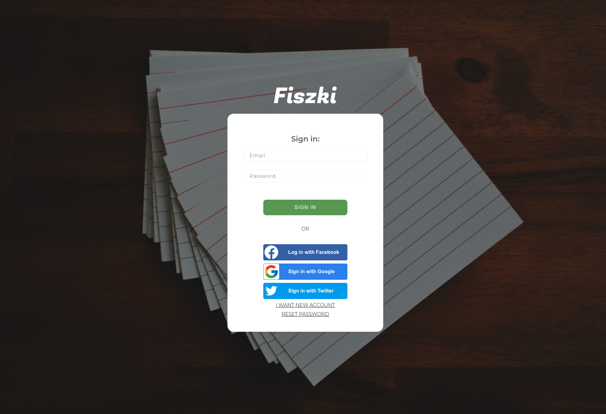
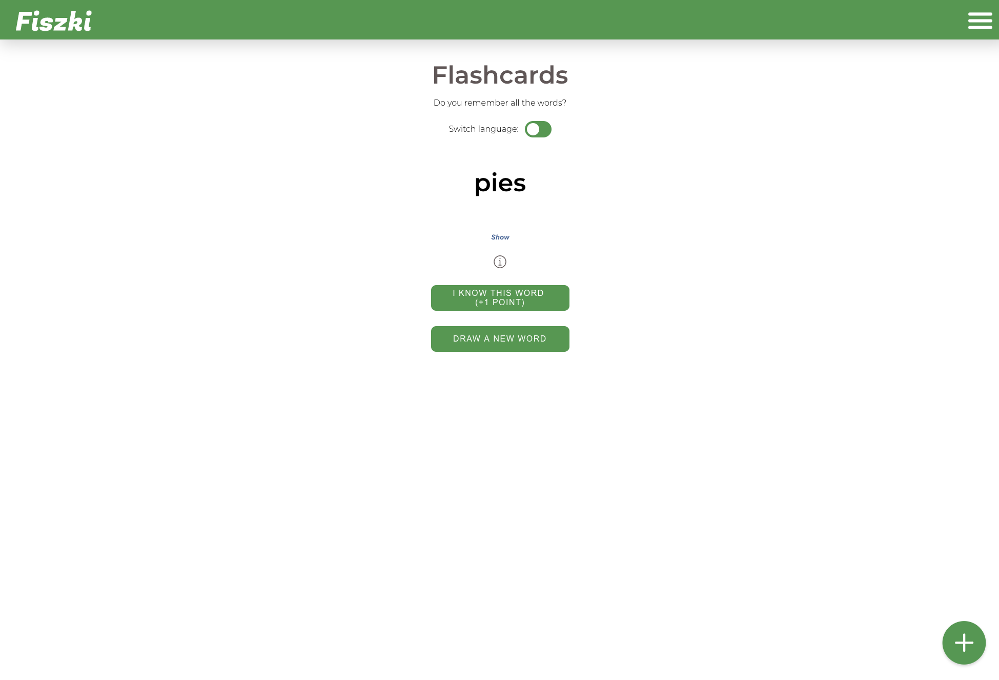
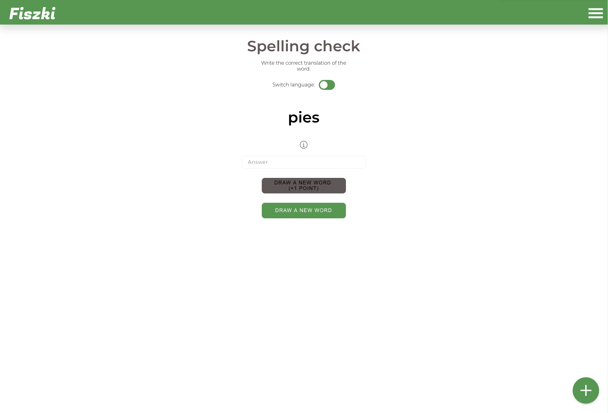
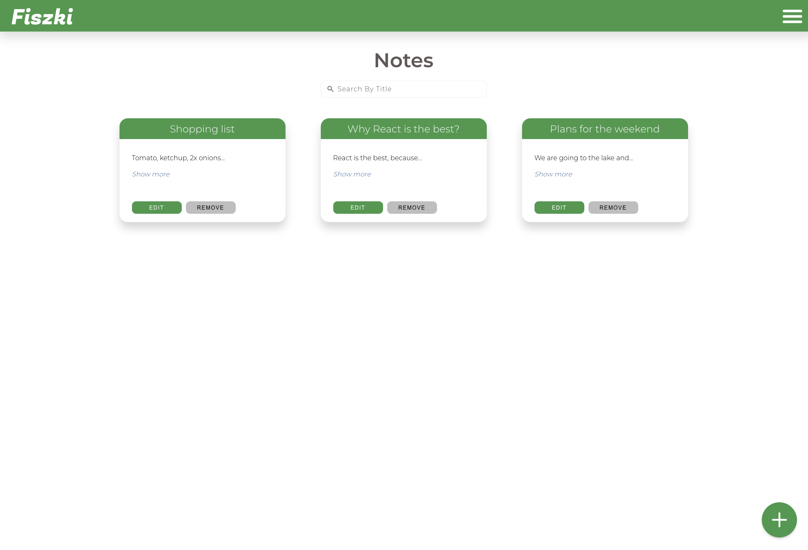
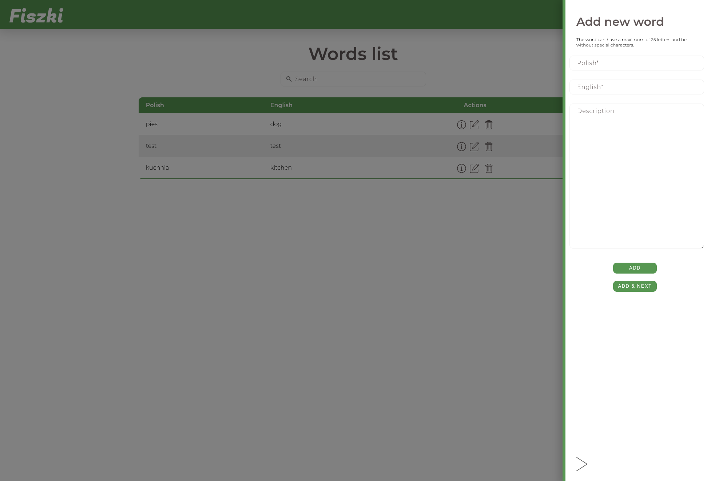

# Fiszki App







## Description

App for develop your English with flashcards and make notes. App with Authentication using Firebase. All data (words and notes) are saved using Firestore.

## Built With

React JS <br />
React Router <br />
Redux <br />
Redux Thunk <br />
date-fns <br />
Formik & Yup <br />
Styled Components <br />
Firebase & Firestore <br />

## Installing

Clone the repository and use this command in your project:

```
yarn install
```

## Authors

Mateusz Gryska
